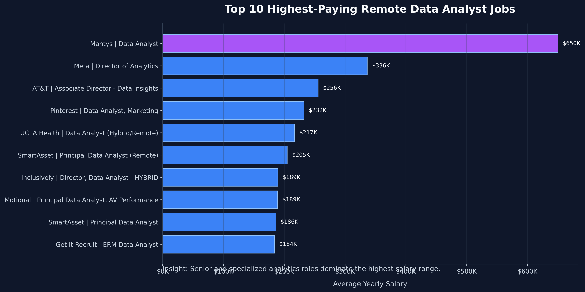
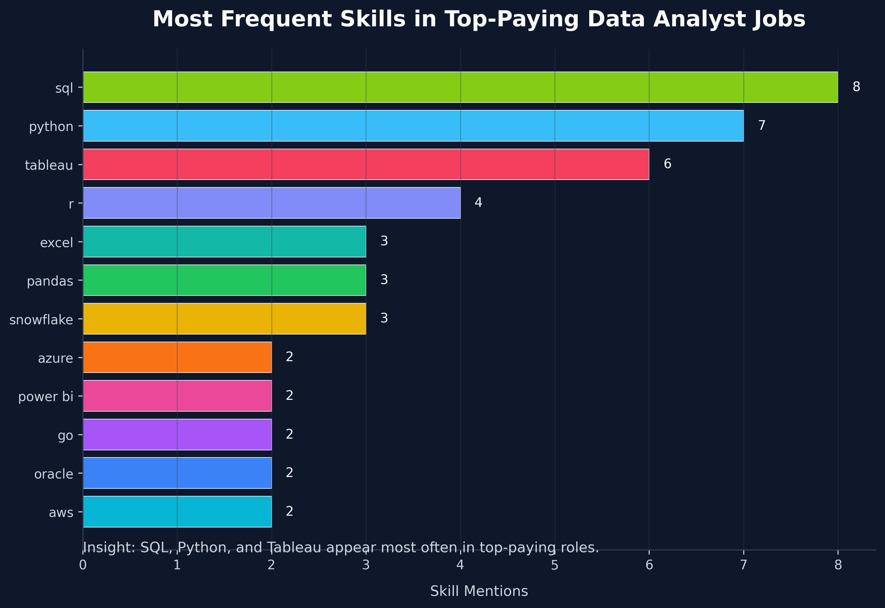
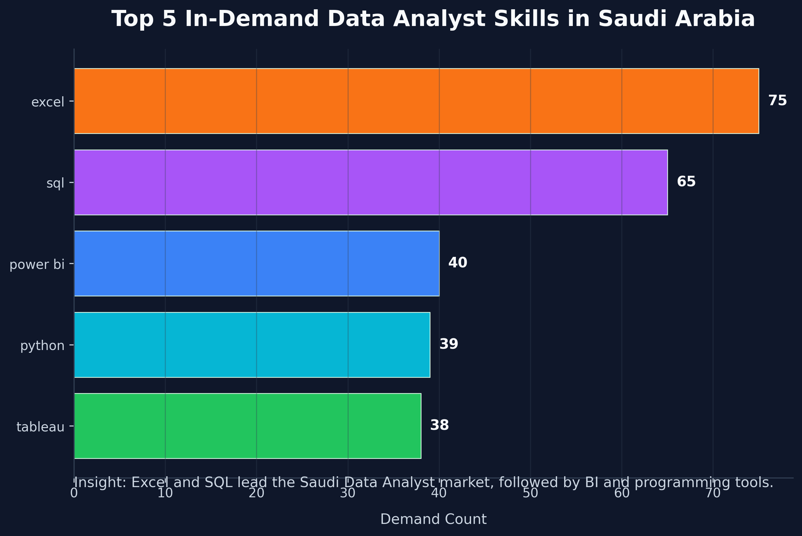
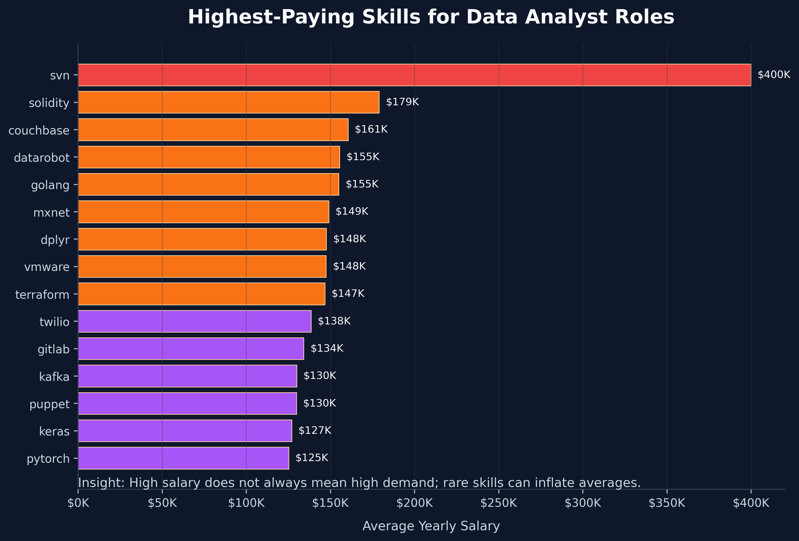
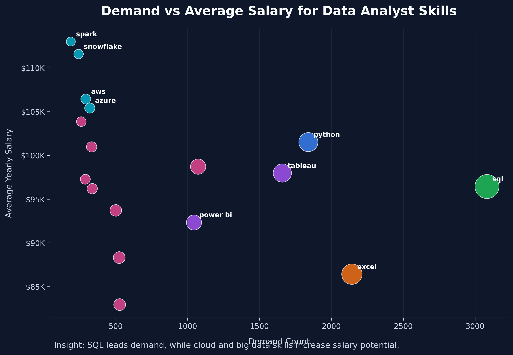

# Data Analyst Job Market Analysis Using SQL

## Overview
This project analyzes Data Analyst job postings to identify high-paying roles, in-demand skills, and the relationship between skill demand and salary.

The analysis was performed using SQL by joining job posting data with company and skill tables. The project focuses on answering practical job market questions such as which skills are most requested, which skills are associated with higher salaries, and which skills provide the best balance between demand and compensation.

## Business Questions
1. What are the highest-paying remote Data Analyst jobs?
2. What skills are required for the highest-paying Data Analyst roles?
3. What are the most in-demand Data Analyst skills in Saudi Arabia?
4. Which skills are associated with the highest average salaries?
5. Which skills combine high demand with strong salary potential?

## Tools Used
- SQL
- PostgreSQL
- Data aggregation
- Joins
- Common Table Expressions (CTEs)
- Filtering and ranking
- Data visualization

## Database Tables
- `job_postings_fact`
- `company_dim`
- `skills_job_dim`
- `skills_dim`

## Key Analysis

### 1. Top-Paying Remote Data Analyst Jobs
This query identifies the top 10 remote Data Analyst roles based on average yearly salary.

Key finding:
- Remote Data Analyst roles show strong salary potential, with some senior or specialized analytics roles exceeding 200K annually.

### 2. Skills Required for Top-Paying Jobs
This query extracts the skills attached to the highest-paying Data Analyst jobs.

Key finding:
- SQL and Python appear frequently among high-paying roles, along with visualization tools and cloud-related technologies.

### 3. Most In-Demand Data Analyst Skills in Saudi Arabia
This query identifies the top skills requested for Data Analyst roles located in Saudi Arabia.

Key finding:
- Excel, SQL, Power BI, Python, and Tableau are the most requested skills for Data Analyst roles in Saudi Arabia.
- The result highlights the importance of combining traditional business tools with technical analytics skills.

### 4. Highest-Paying Data Analyst Skills
This query calculates the average salary associated with each skill.

Key finding:
- Some advanced or specialized technical skills are linked to higher salaries.
- However, high salary does not always mean high demand, so salary should be interpreted alongside demand count.

### 5. Demand vs Salary Analysis
This final query combines skill demand and average salary to identify skills that are both valuable and frequently requested.

Key finding:
- SQL has the highest demand and strong salary potential.
- Python offers higher average salary than Excel while maintaining strong demand.
- Cloud and big data skills such as AWS, Azure, Snowflake, and Spark are associated with higher salaries despite lower demand compared to core analytics skills.

## Final Insights
- SQL is the most important skill for Data Analyst roles based on demand.
- Excel remains highly requested, especially in business-oriented analytics roles.
- Python provides strong salary leverage and is valuable for more technical data analysis roles.
- Power BI and Tableau remain important visualization tools, with Power BI being especially relevant for business intelligence roles.
- Advanced data tools such as Snowflake, Spark, AWS, and Azure can increase salary potential.

## Conclusion
This project demonstrates how SQL can be used to analyze job market trends, compare skill demand, and identify high-value skills for Data Analyst career planning.

The analysis shows that a strong Data Analyst skill set should include:
- SQL
- Excel
- Python
- Power BI or Tableau
- Cloud or data warehouse tools for advanced career growth
